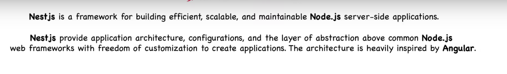
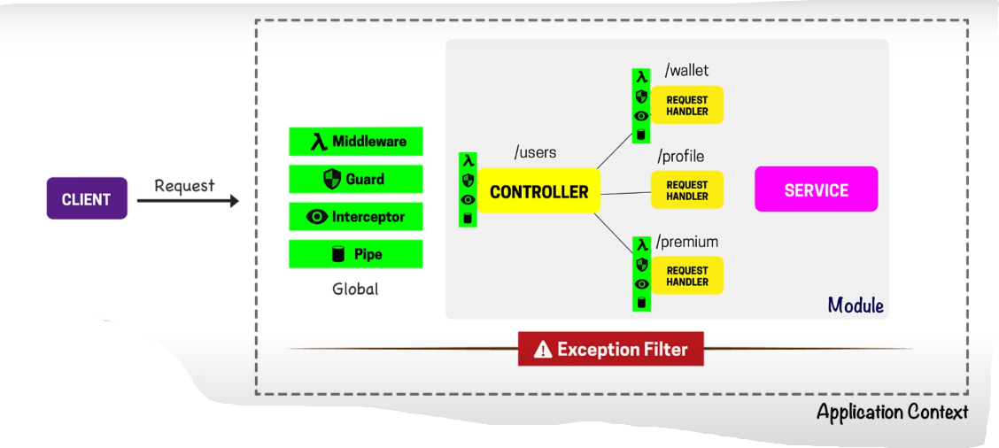
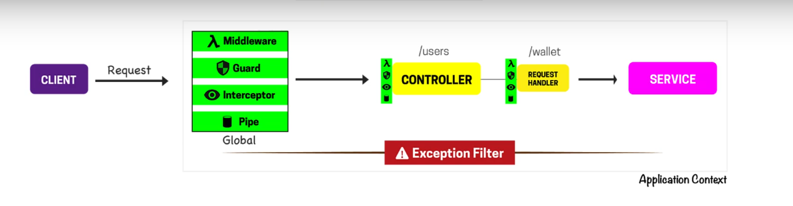
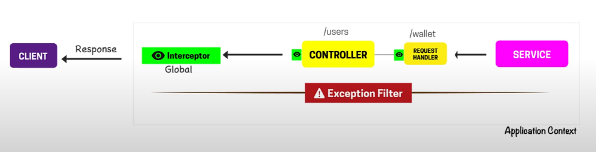
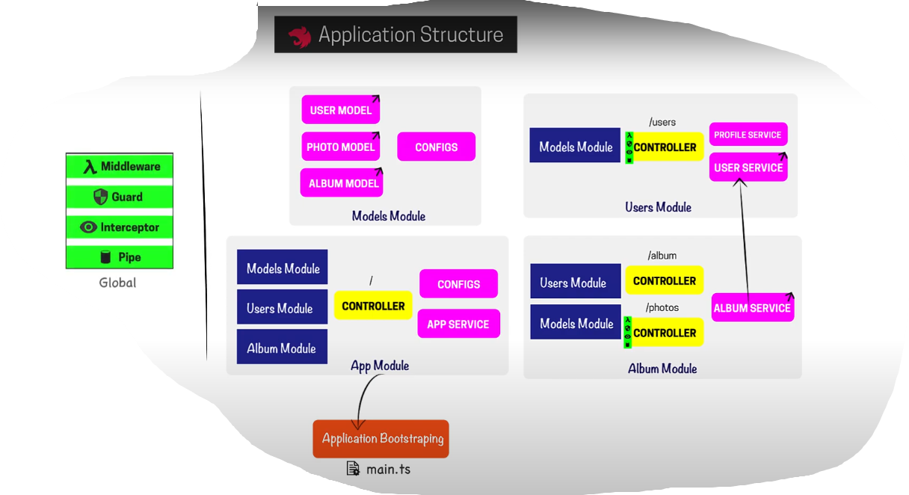

## Nest Js

#### Nest Js Architecture

#### Usages of Guard, Pipe

- Guard basically decides whether we need to to process the incoming request or not.

- Pipe is used for data validation and transformation purpose before it reaches to controller.

### Application Structure 

